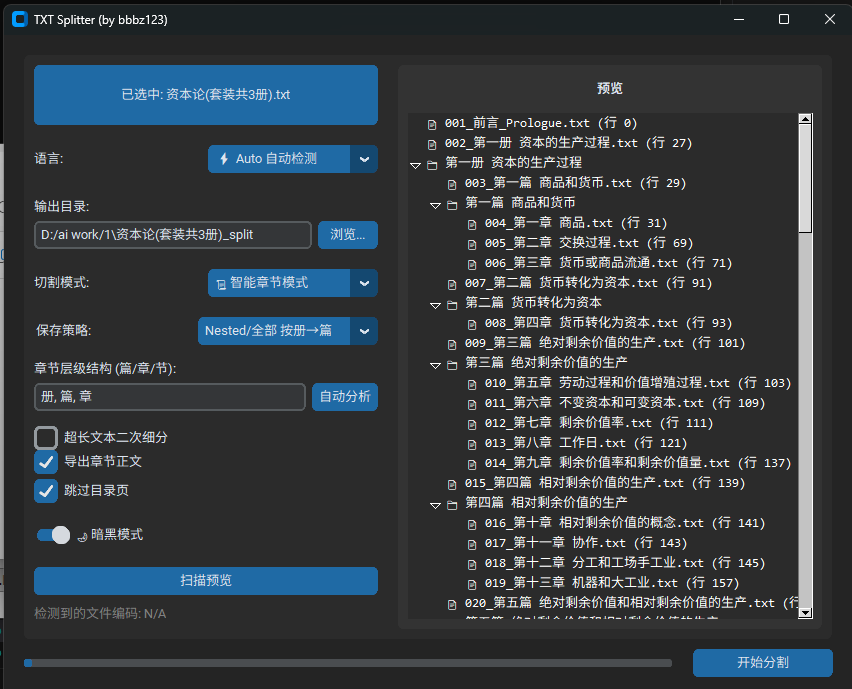

# TXT Splitter (智能文本切割器)

[中文版](./README.md) | [English Version](./README_EN.md)

TXT Splitter 是一款强大且智能的本地文本/小说/文档切分工具。系统能够智能分析长篇文本（如小说、法律文献等）内嵌的目录结构，精准提取出真正的嵌套层级（从“卷/编”到“章/节”等），彻底解决各种复杂单字与多字结构的层级错乱问题。



除了基于智能目录分析的“按章节”切割，它还支持各种固定维度的物理切分方式，提供优雅美观的深色/浅色交互式图形界面（GUI）。

## ✨ 核心特性

- **🧠 动态智能大纲学习 (Dynamic Hierarchy Analysis)**：
  不同于传统的写死规则匹配，系统会优先提取并学习文件的实际目录（Table of Contents），自动通过前缀数字等排列情况测算真实的树状包含关系。即使遇到“编”和“分编”平级或混乱交错的文档结构，也能推断出最完美的包含体系。
- **✅ 多维度切分模式**：
  - **Size (大小)**：按文件字节/体积（KB/MB）匀速拆分。
  - **Words (字数)**：限制每个切片文件的最大字数（避免切断段落）。
  - **Lines (行数)**：指定每个切片包含的最大文本行。
  - **Paragraphs (段落)**：依照自然段落数分割文件。
  - **Chapters (章节)**：最强大的模式；支持平铺（Flat）输出所有章节，或依照目录生成的“嵌套目录”（Nested）拆分结构重建一模一样的文件夹架构。
- **📂 拖拽支持 & 批量处理**：
  支持长文本（或多份文件一键全选）拖拽直接进入等待队列，全后台多线程并发拆分，不会卡屏顿挫。
- **🎨 现代图形化界面**：
  基于 CustomTkinter 构建，支持暗黑模式/浅色模式切换，流畅适配现代操作系统桌面交互习惯。
- **🔒 隐私与离线**：
  纯本地运算，无需连网，保证隐私文档绝对安全脱机处理。

## 📦 如何运行与安装

系统基于 Python 3.12+ 编写并已全套打包。这说明您可以采用以下任意一种方式运行：

### 方式一：直接运行成品 EXE （推荐）

打包后无需安装任何 Python 环境！

1. 进入 `dist/main/` 目录。
2. 双击打开 `main.exe` 即可启动图形化界面。

### 方式二：从源代码运行

如果您希望进行二次开发和修改：

1. 请确保您已安装 Python 环境。
2. 安装依赖库：

   ```bash
   pip install -r requirements.txt
   ```

3. 运行应用程序入口：

   ```bash
   python main.py
   ```

## 📖 使用指南

1. **拖入文件**：把想要切分的 `.txt` 文件（或同时一批文件）拖进软件主窗口的 “Listbox” 中。如果不喜欢拖拽，也可以点击加号 `+` 手动浏览导入。
2. **设定模式**：在下方选择您的切分模式（字数、行数或是章节）。
    - 💡 **提示**：如果是按章节切分，建议先点击面板区域左下角的 `自动分析` 按钮，让系统为您推算出最适配本书的结构（如：`编, 章, 节`）。
    - 💡 **跳过目录**：当书籍含有超长总目录时，开启“跳过目录页”选项可以免去将目录视为独立冗长碎片章节。
    - 💡 **目录树层间距**：当通过分析得出书籍为多层结构（如 卷 -> 篇 -> 章）时，可以选择“Nested: XXX”让系统为您自动建立与原书一样的文件夹树。
3. **选择输出位置**：您可以选填自己喜欢的空目录（否则软件将在桌面或源文件旁新建一个命名为 `📁_Batch_XXX` 的批处理干净文件夹）。
4. **一键切割**：按下底部显眼的 `Start Splitting`（开始切割），进度条和后台将自动完成剩余工作。
5. **打开预览**：切割完毕后会自动提示，点击主界面的 `Open` 等可一键弹出刚才切好的对应最终目标产出。

## 🛠️ 树状架构与开发

本项目结构非常精简，功能边界清晰：

```text
txt_splitter/
├── main.py                    # 软件入口程序，启动点
├── split_user_files.py        # 备用/命令行脚本（CLI无头模式执行用）
├── core/
│   ├── __init__.py
│   └── parser.py              # 核心引擎：负责正则流派切分、动态目录分析、智能防乱码解析等算法
├── gui/
│   ├── __init__.py
│   └── app.py                 # UI视图层：多线程包装与调度、UI重绘、拖放库加载集成等
├── tests/                     # 各种白盒自动化集成测试组件（含AST代码检测）
└── build & dist/              # PyInstaller 生成的发行可执行文件缓存位
```

## 📄 许可及感谢

该工具为个人智能文本整理辅助。依赖库致谢：

- `customtkinter` 驱动漂亮的现代图形组件。
- `tkinterdnd2` 解锁原生 Windows 优雅的直接拖拽能力。
- 全架构自动扫描查重工具等保障了极致高效的运行性能。
